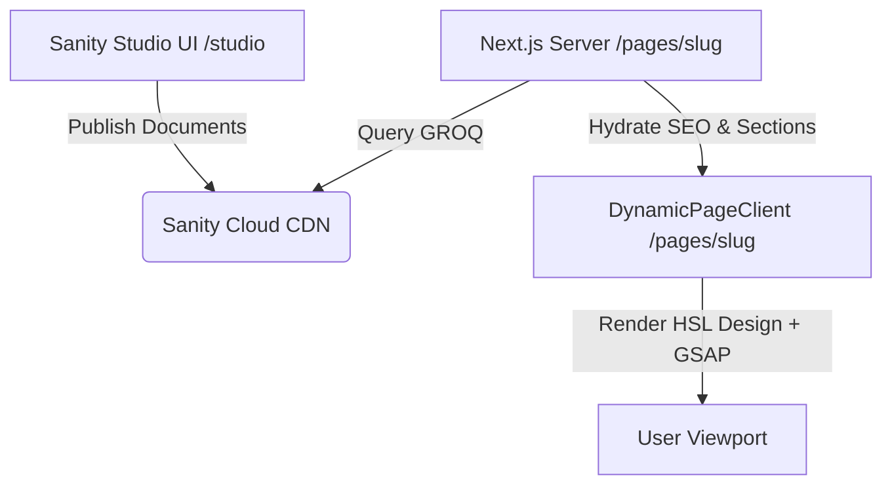

# Project Milestone Report: Sanity CMS Schema-Driven Headless Integration
## Client: ORR Solutions
**Status:** Completed & Validated

---

## 1. Executive Summary

This milestone marks the successful design, integration, and validation of **Sanity CMS** as the central, schema-driven content engine for the **ORR Solutions** platform. 

The implementation transitions key areas of the platform from hardcoded web structures to a dynamic, headless page-builder system. By decoupling backend management from frontend updates, administrators can now create pages, construct customized layout structures, write blog posts, and configure search engine settings in real-time, requiring zero developer intervention or code redeployments.

---

## 2. Completed Milestones & Technical Achievements

### A. Schema Architecture & Design
Three scalable, production-grade schemas were designed, coded, and registered in Sanity's registry index (`client/sanity/schemaTypes/index.ts`):
1. **Unified SEO Schema (`seo`):** A modular metadata block capturing target keywords, meta descriptions, canonical URLs, robot indexing instructions, and custom social sharing (Open Graph) preview images.
2. **Page Builder Schema (`dynamicPage`):** Supports three custom page templates (**Landing**, **Service**, **About**) and dynamic section layouts including:
   * **Hero & Secondary CTAs:** Fully custom text and background styles.
   * **Side-by-side Image-Text Blocks:** Customizable layout alignment.
   * **Feature Cards Grid:** Dynamic Lucide icon resolution.
   * **Embedded Media Blocks:** Seamless responsive YouTube/Vimeo viewport embedding.
   * **Rich Text Areas:** Custom PortableText paragraphs, bullet layouts, and headings.
3. **Enhanced Blog Post Schema (`post`):** Upgraded to support administrative controls for content authors, customizable category tags, expected reading times, and dedicated SEO fields.

### B. High-Performance Frontend & Routing Integration
* **Dynamic Page Routing (`/pages/[slug]`):** Connects to the page builder database, leveraging Next.js static parameters and incremental static regeneration (ISR `revalidate = 60`) for sub-second page delivery.
* **Direct Blog Routing (`/blog/[slug]`):** Direct SEO-ready server route rendering blog details at `/blog/[slug]`.
* **Dynamic Meta Hydration:** Integrates with Next.js `generateMetadata` protocol, parsing the custom `seo` block fields from Sanity into clean head tags (meta title, description, robots, canonicals, Twitter, and OG cards).

### C. Aesthetic UI & Interactive Components
* **DynamicPageClient (`DynamicPageClient.tsx`):** Styled with premium HSL color tokens, micro-animations, glassmorphic card patterns, responsive grids, and scroll-triggered animations powered by **GSAP**.
* **Media Optimization:** Utilizes Sanity's Image CDN to deliver optimized formats and crop-hotspot coordinate tracking dynamically parsed into Next.js responsive image components.

---

## 3. Architecture & Data Flow

---

## 4. Verification & Testing Results

1. **Compilation Success:** The Next.js production compiler (`npm run build`) successfully built the application, verifying TypeScript definitions, SSG paths, and route compilation.
2. **Integration Verification:** A custom TypeScript connection test script successfully verified that GROQ queries fetch data, map schema structures, and parse components correctly.
3. **Simultaneous Studio Access:** Verification confirmed that both the embedded Next.js studio route (`/studio`) and the standalone local studio server (`port 3333`) are functional.

---

## 5. Next Steps & Content Handover

1. **Author Onboarding:** Provide administrators with credentials for Sanity project ID `2jqm6m49` to begin creating layout pages.
2. **Structured Content Migration:** Gradually migrate existing static text blocks from the frontend components into the Sanity CMS schema structures.
3. **Webhooks Setup (Production):** Configure a Sanity webhook in production to clear Next.js ISR caches immediately upon publication.
